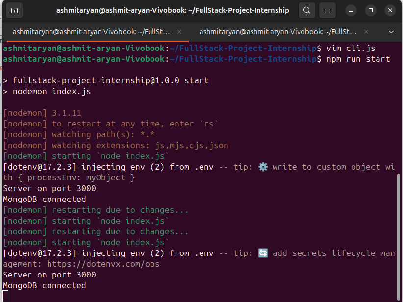

# CLI Task Manager
Command-line utility with full-stack backend.

## Design Decisions
- Modular: CLI separate from API for testability.
- Error handling: Try-catch + specific messages.
- Assumptions: MongoDB local; users validate inputs.

## How to Run
1. npm install
2. Setup MongoDB
3. npm run start (backend)
4. node cli.js add "Test task" --due 2026-01-25

## Sample Output


```
